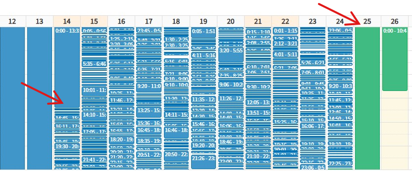

# Troubleshooting: Devices Show Offline When They Are Online

In some network setups, certain devices may intermittently appear as **offline** in NetAlertX, even though they are connected and responsive. This issue is often more noticeable with devices that have **higher IP addresses** within the subnet.

> [!NOTE]
>
> Network presence graph showing increased drop outs before enabling additional `ICMP` scans and continuous online presence after following this guide. This graph shows a sudden spike in drop outs probably caused by a device software update.
> 

## Symptoms

* Devices sporadically show as offline in the presence timeline.
* This behavior often affects devices with higher IPs (e.g., `192.168.1.240+`).
* Presence data appears inconsistent or unreliable despite the device being online.

## Cause

This issue is typically related to scanning limitations:

* **ARP scan timeouts** may prevent full subnet coverage.
* **Sole reliance on ARP** can result in missed detections:

  * Some devices (like iPhones) suppress or reject frequent ARP requests.
  * ARP responses may be blocked or delayed due to power-saving features or OS behavior.

* **Scanning frequency conflicts**, where devices ignore repeated scans within a short period.

## Recommended Fixes

To improve presence accuracy and reduce false offline states:

### ✅ Increase ARP Scan Timeout

Extend the ARP scanner timeout to ensure full subnet coverage:

```env
ARPSCAN_RUN_TIMEOUT=360
```

> Adjust based on your network size and device count.

### ✅ Add ICMP (Ping) Scanning

Enable the `ICMP` scan plugin to complement ARP detection. ICMP is often more reliable for detecting active hosts, especially when ARP fails. 

### ✅ Use Multiple Detection Methods

A combined approach greatly improves detection robustness:

* `ARPSCAN` (default)
* `ICMP` (ping)
* `NMAPDEV` (nmamp)

This hybrid strategy increases reliability, especially for down detection and alerting. See [other plugins](./PLUGINS.md) that might be compatible with your setup. See benefits and drawbacks of individual scan methods in their respective docs. 

## Results

After increasing the ARP timeout and adding ICMP scanning (on select IP ranges), users typically report:

* More consistent presence graphs
* Fewer false offline events
* Better coverage across all IP ranges

## Summary

| Setting               | Recommendation                                |
| --------------------- | --------------------------------------------- |
| `ARPSCAN_RUN_TIMEOUT` | Increase to ensure scans reach all IPs        |
| `ICMP` Scan           | Enable to detect devices ARP might miss       |
| Multi-method Scanning | Use a mix of ARP, ICMP, and NMAP-based methods |

---

**Tip:** Each environment is unique. Consider fine-tuning scan settings based on your network size, device behavior, and desired detection accuracy.

Let us know in the [NetAlertX Discussions](https://github.com/jokob-sk/NetAlertX/discussions) if you have further feedback or edge cases.

See also [Remote Networks](./REMOTE_NETWORKS.md) for more advanced setups. 