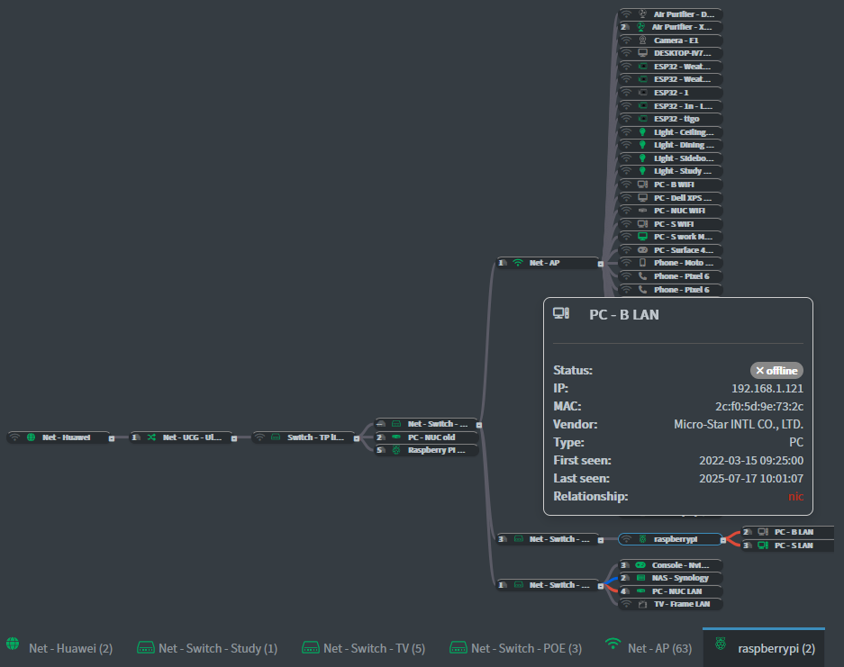
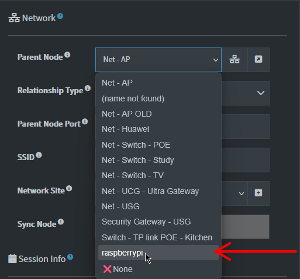
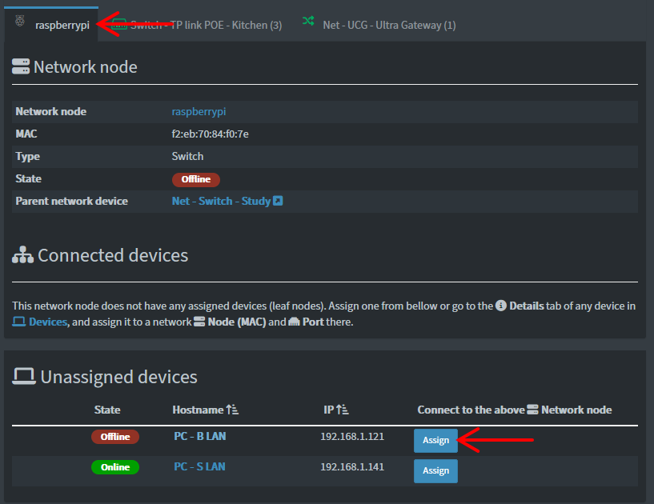

## How to Set Up Your Network Page

The **Network** page lets you map how devices connect — visually and logically.  
It’s especially useful for planning infrastructure, assigning parent-child relationships, and spotting gaps.

To get started, you’ll need to define at least one root node and mark certain devices as network nodes (like Switches or Routers).

---

Start by creating a root device with the MAC address `Internet`, if the application didn’t create one already.  
This is the only MAC currently supported as a root network node.  
Set its **Type** to something valid in a networking context — for example: `Router` or `Gateway`.

> [!TIP]  
> If you don’t have one, use the [Create new device](./DEVICE_MANAGEMENT.md#dummy-devices) button on the **Devices** page to add a root device.

---

## ⚡ Quick Setup

1. Open the device you want to use as a network node (e.g. a Switch).
2. Set its **Type** to one of the following:
   `AP`, `Firewall`, `Gateway`, `PLC`, `Powerline`, `Router`, `Switch`, `USB LAN Adapter`, `USB WIFI Adapter`, `WLAN`  
   *(Or add custom types under **Settings → General → `NETWORK_DEVICE_TYPES`**.)*
3. Save the device.
4. Go to the **Network** page — supported device types will appear as tabs.
5. Use the **Assign** button to connect unassigned devices to a network node.
6. If the **Port** is `0` or empty, a Wi-Fi icon is shown. Otherwise, an Ethernet icon appears.

> [!NOTE]  
> Use [bulk editing](./DEVICES_BULK_EDITING.md) with _CSV Export_ to fix `Internet` root assignments or update many devices at once.

---

## Example: Setting up a `raspberrypi` as a Switch

Let’s walk through setting up a device named `raspberrypi` to act as a network Switch that other devices connect through.

---

### 1. Set Device Type and Parent

- Go to the **Devices** page  
- Open the device detail view for `raspberrypi`

- In the **Type** dropdown, select `Switch`  

- Optionally assign a **Parent Node** (where this device connects to) and the **Relationship type** of the connection. The `nic` relationship type can affect parent notifications — see the setting description and [Notifications documentation](./NOTIFICATIONS.md) for more.

> [!NOTE]  
> Only certain device types can act as network nodes:  
> `AP`, `Firewall`, `Gateway`, `Hypervisor`, `PLC`, `Powerline`, `Router`, `Switch`, `USB LAN Adapter`, `USB WIFI Adapter`, `WLAN`  
> You can add custom types via the `NETWORK_DEVICE_TYPES` setting.

- Click **Save**

---

### 2. Confirm It Appears as a Network Node

- Go to the **Network** page

- You’ll now see a `raspberrypi` tab — it’s recognized as a network node (Switch)
- You can assign other devices to it

---

### 3. Assign Connected Devices

- Use the **Assign** button to link other devices (e.g. PCs) to `raspberrypi`

- Once assigned, devices will show as connected to the `raspberrypi` switch node  
- Relationship lines may vary in color based on the selected Relationship type. These are editable on the device details. 

Happy with your setup? [Back it up](./BACKUPS.md).
