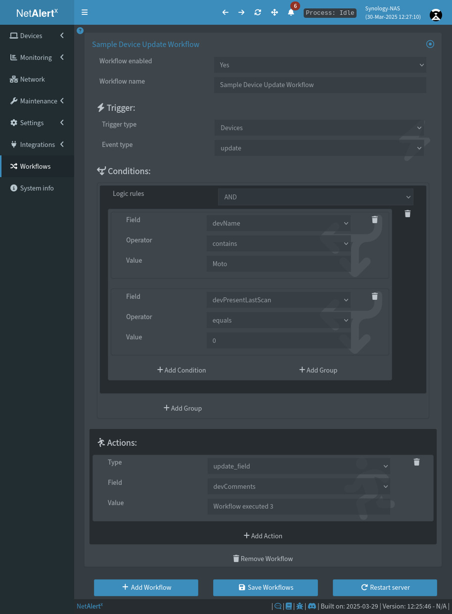

# Workflows Overview

The workflows module in NetAlertX allows you to automate repetitive tasks, making network management more efficient. Whether you need to assign newly discovered devices to a specific Network Node, auto-group devices from a given vendor, unarchive a device if detected online, or automatically delete or archive devices, this module provides the flexibility to tailor the automations to your needs.

Below are a few examples that demonstrate how this module can be used to simplify network management tasks.

> [!NOTE] 
> In order to apply a workflow change, you must first **Save** the changes and then reload the application by clicking **Restart server**.

## Triggers

Triggers define the event that activates a workflow. They monitor changes to objects within the system, such as updates to devices or the insertion of new entries. When the specified event occurs, the workflow is executed.

### Example Trigger:
- **Object Type**: `Devices`
- **Event Type**: `update`
  
This trigger will activate when a `Device` object is updated.

## Conditions

Conditions determine whether a workflow should proceed based on certain criteria. These criteria can be set for specific fields, such as whether a device is from a certain vendor, or whether it is new or archived. You can combine conditions using logical operators (`AND`, `OR`).

> [!TIP]
> To better understand how to use specific Device fields, please read through the [Database overview](./DATABASE.md) guide.

### Example Condition:
- **Logic**: `AND`
  - **Field**: `devVendor`
  - **Operator**: `contains`
  - **Value**: `Google`
  
  This condition checks if the device's vendor is `Google`. The workflow will only proceed if the condition is true.

## Actions

Actions define the tasks that the workflow will perform once the conditions are met. Actions can include updating fields or deleting devices.

### Example Action:
- **Action Type**: `update_field`
  - **Field**: `devIsNew`
  - **Value**: `0`
  
  This action updates the `devIsNew` field to `0`, marking the device as no longer new.

# Examples

Below you can find a couple of configuration examples.

---

## Example 1: Assign Device to Network Node Based on IP

This workflow assigns newly added devices with IP addresses in the `192.168.1.*` range to the device with the MAC address `6c:6d:6d:6c:6c:6c`.

### Trigger:
- **Object Type**: `Devices`
- **Event Type**: `insert`

### Conditions:
- **Logic**: `AND`
  - `Field`: `devLastIP`
  - `Operator`: `contains`
  - `Value`: `192.168.1.`
  
  This condition ensures that the workflow only applies to devices with an IP address in the `192.168.1.*` range.

### Actions:
- **Action Type**: `update_field`
  - **Field**: `devNetworkNode`
  - **Value**: `6c:6d:6d:6c:6c:6c`

---

## Example 2: Mark Device as Not New and Delete If from Google Vendor

This workflow automates the process of marking Google devices as not new and deleting them if they meet the criteria.

### Trigger:
- **Object Type**: `Devices`
- **Event Type**: `update`

### Conditions:
- **Logic**: `AND`
  - `Field`: `devVendor`
  - `Operator`: `contains`
  - `Value`: `Google`
  
  This condition checks if the device's vendor is `Google`.

- **Logic**: `AND`
  - `Field`: `devIsNew`
  - `Operator`: `equals`
  - `Value`: `1`
  
  This ensures the workflow applies only to new devices.

### Actions:
1. **Action Type**: `update_field`
   - **Field**: `devIsNew`
   - **Value**: `0`

   This action marks the device as no longer new.

2. **Action Type**: `delete_device`
   
   This action deletes the device after it is marked as not new.

---

### Conclusion

With workflows, NetAlertX can automatically adjust to network changes, saving time and reducing the manual overhead involved in maintaining your devices. You can create highly tailored automation rules to handle everything from basic updates to more complex device management.
